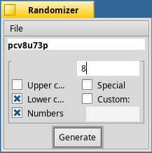

Randomizer
==========



Random symbol sequence (e.g. password) generator for Haiku

Build Instructions:
  * Clone the repo and run the following:
  ```
  cd Randomizer/src
  make
  ./Randomizer
  ```

Requirements:
* Haiku R1/beta1 or newer

Changes since last release:
* See ChangeLog.

License: MIT. See LICENSE for details.
